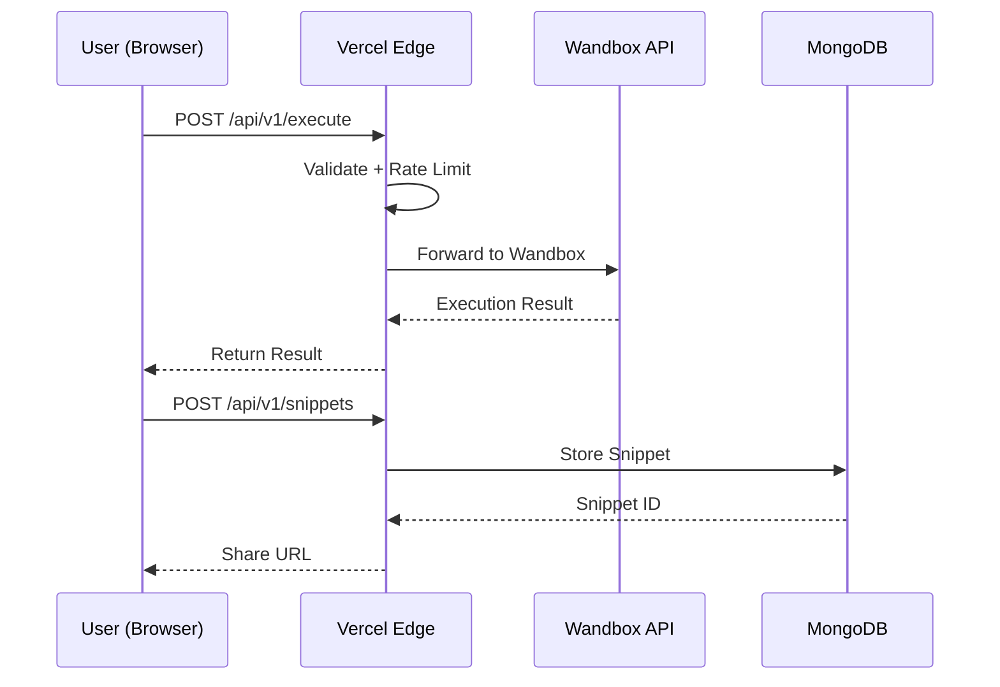

# ⚡ ExecuteX — 18-Language Online Compiler Platform

ExecuteX is a high-performance, serverless code execution environment designed for developers to test and share snippets across 18 programming languages. Built with a focus on speed, utilizing zero-latency edge integrations.


---

## 🚀 Key Features

*   **18 Supported Languages**: From Core CS (C/C++, Java) to Modern Systems (Rust, Go) and Data Science (Python, R, Julia).
*   **Wandbox API Integration**: Blazing fast serverless execution powered by the Wandbox compiler engine.
*   **Zero-Latency Pinging**: Browser-to-compiler architecture eliminates backend middleman latency.
*   **Rich IDE Experience**: Powered by the **Monaco Editor** (the engine behind VS Code) with syntax highlighting and theme support.
*   **Snippet Sharing**: Generate unique URLs for your code snippets to share with others.
*   **Premium UI**: Dark-mode first, glassmorphism design for modern aesthetics.

---

## 🛠️ Architecture

ExecuteX uses a **Zero-Host Serverless** architecture designed to scale infinitely on Vercel without maintaining execution nodes.



### Tech Stack
*   **Frontend**: React 18, Vite, Zustand, Monaco Editor.    
*   **Compiler Engine**: Wandbox API (Directly from Browser)
*   **Backend (Sharing)**: Vercel Serverless Functions (Node.js/Express)
*   **Database**: MongoDB (Code Sharing)
*   **Hosting**: Vercel

---

## 🚦 Getting Started

### Prerequisites
*   Node.js (for local development)
*   MongoDB URI (for snippet sharing features)

### Local Development

```bash
# 1. Clone the repository
git clone https://github.com/yash23082007/executeX.git
cd executeX

# 2. Setup your Environment Variables in /server/.env
# MONGO_URI="mongodb+srv://..."

# 3. Install dependencies and start the platform
npm run install:all
npm run dev
```

Platform will be available at `http://localhost:5173`.

---

## 🤝 Contributing

Contributions are welcome! Please feel free to submit a Pull Request.

1.  Fork the Project.
2.  Create your Feature Branch (`git checkout -b feature/AmazingFeature`).      
3.  Commit your Changes (`git commit -m 'Add some AmazingFeature'`).
4.  Push to the Branch (`git push origin feature/AmazingFeature`).
5.  Open a Pull Request.

---

*Built with ❤️ by the ExecuteX Team.*